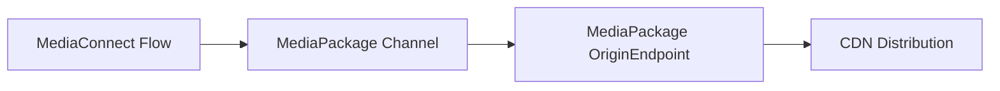
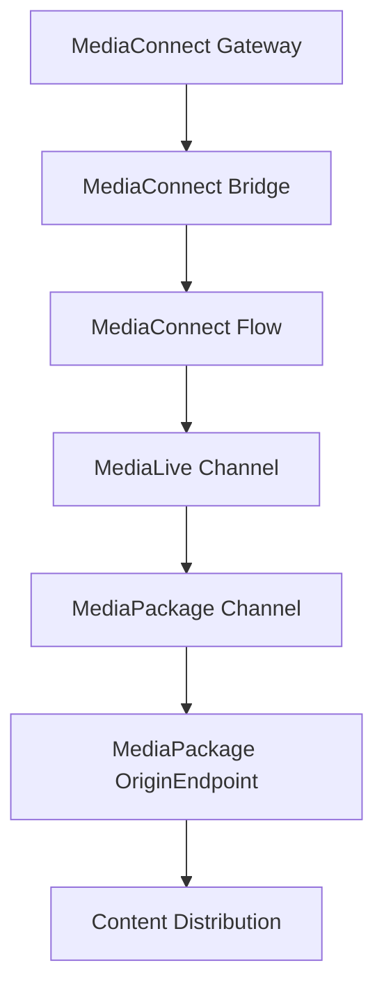

# AWS Elemental Resources Documentation

This documentation covers the AWS Elemental resources available through the Crossplane configuration for AWS Elemental services. These resources enable you to provision and manage AWS Elemental media services infrastructure using Kubernetes-native declarative configuration.

## Overview

The AWS Elemental Crossplane configuration provides Composite Resource Definitions (XRDs) and Compositions for major AWS Elemental services, allowing you to create and manage live video workflows, transcoding pipelines, and content distribution systems using Kubernetes resources.

## Available Resources

### MediaConnect

AWS Elemental MediaConnect resources for live video transport and connectivity.

- **[Bridge](mediaconnect-bridge.md)** - Create bridges for connecting cloud and on-premises video workflows
- **[Flow](mediaconnect-flow.md)** - Transport live video content over IP networks with enterprise-grade security
- **[Gateway](mediaconnect-gateway.md)** - Connect on-premises equipment to MediaConnect flows in the cloud

### MediaConvert

AWS Elemental MediaConvert resources for video transcoding and processing.

- **[JobTemplate](mediaconvert-jobtemplate.md)** - Create job templates for standardizing video transcoding workflows

### MediaLive

AWS Elemental MediaLive resources for live video processing and encoding.

- **[MultiplexProgram](medialive-multiplexprogram.md)** - Create multiplex programs for combining multiple video streams
- **[Network](medialive-network.md)** - Manage IP address pools and routing configurations for live video workflows

### MediaPackage

AWS Elemental MediaPackage resources for video packaging and delivery.

- **[OriginEndpoint](mediapackage-originendpoint.md)** - Package and deliver live video content in various streaming formats

### MediaPackage V2

Next-generation AWS Elemental MediaPackage resources with enhanced features.

- **[Channel](mediapackagev2-channel.md)** - Ingest and process live video content with enhanced performance
- **[ChannelGroup](mediapackagev2-channelgroup.md)** - Organize and manage collections of related channels

### Workflow Orchestration

Advanced workflow orchestration capabilities for complex media pipelines.

- **[Workflow](workflow.md)** - Create complex, multi-step workflows with resource dependencies and dynamic value injection

## Resource Types

Each AWS Elemental resource is available in two forms:

### Composite Resources (Cluster-Scoped)
- **Prefix**: `X` (e.g., `XFlow`, `XBridge`)
- **Scope**: Cluster-wide
- **Usage**: Direct creation of resources across the cluster
- **API Group**: `*.aws.livewyer.io`

### Claims (Namespace-Scoped)
- **Prefix**: None (e.g., `Flow`, `Bridge`)
- **Scope**: Namespace-specific
- **Usage**: Application-specific resource claims within namespaces
- **API Group**: `*.aws.livewyer.io`

## Getting Started

### Prerequisites

1. **Crossplane Installation**: Ensure Crossplane is installed in your Kubernetes cluster
2. **AWS Provider**: Configure the AWS provider with appropriate credentials
3. **Provider Configuration**: Create ProviderConfig resources for AWS authentication

### Basic Usage

1. **Create a ProviderConfig**:
```yaml
apiVersion: aws.crossplane.io/v1beta1
kind: ProviderConfig
metadata:
  name: aws-provider-config
spec:
  credentials:
    source: Secret
    secretRef:
      namespace: crossplane-system
      name: aws-secret
      key: creds
```

2. **Create Resources**: Use the documented resources to build your media workflows

3. **Monitor Status**: Check resource status using standard Kubernetes commands:
```bash
kubectl get flows
kubectl describe flow my-flow
```

## Common Patterns

### Basic Live Streaming Workflow



### Complex Broadcast Workflow



## Resource Dependencies

Understanding resource dependencies is crucial for building successful workflows:

1. **MediaConnect Gateway** → **MediaConnect Bridge** (placement)
2. **MediaConnect Flow** → **MediaConnect Bridge** (source)
3. **MediaPackageV2 ChannelGroup** → **MediaPackageV2 Channel**
4. **Various Resources** → **Workflow** (orchestration)

## Best Practices

### Resource Naming
- Use descriptive, consistent naming conventions
- Include environment indicators (prod, dev, staging)
- Use organization-specific prefixes
- Avoid special characters that might cause issues

### Resource Organization
- Group related resources in the same namespace
- Use labels and annotations for resource organization
- Implement proper tagging strategies for cost tracking
- Document resource purposes and dependencies

### Security Considerations
- Use appropriate RBAC controls for resource access
- Implement network security policies
- Configure encryption where applicable
- Follow AWS security best practices

### Monitoring and Observability
- Implement comprehensive monitoring for all resources
- Set up alerting for resource failures
- Use proper logging and observability tools
- Monitor costs and resource utilization

## Support and Troubleshooting

### Common Issues

1. **Resource Creation Failures**
   - Check ProviderConfig authentication
   - Verify AWS permissions
   - Review resource specifications for errors

2. **Dependency Resolution**
   - Ensure dependent resources exist and are ready
   - Check resource status conditions
   - Verify cross-references and ARNs

3. **Performance Issues**
   - Monitor AWS service limits
   - Check resource configurations
   - Review network connectivity

### Getting Help

- Review individual resource documentation for detailed configuration options
- Check Crossplane documentation for general troubleshooting
- Consult AWS service documentation for service-specific issues
- Use Kubernetes debugging commands for resource inspection

## Contributing

When contributing to this documentation:

1. Follow the established documentation structure
2. Include comprehensive examples for each use case
3. Document all configuration options and constraints
4. Provide troubleshooting guidance
5. Update this index when adding new resources

## API Versions

All resources use API version `v1alpha1` indicating they are in active development. Breaking changes may occur between versions. Always check the specific resource documentation for the most current configuration options and examples.

---

*This documentation is maintained as part of the AWS Elemental Crossplane configuration. For the latest updates and additional resources, please refer to the individual resource documentation files.*
